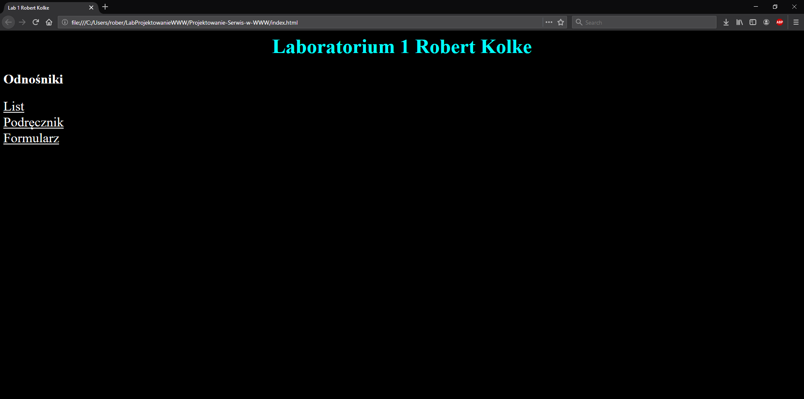
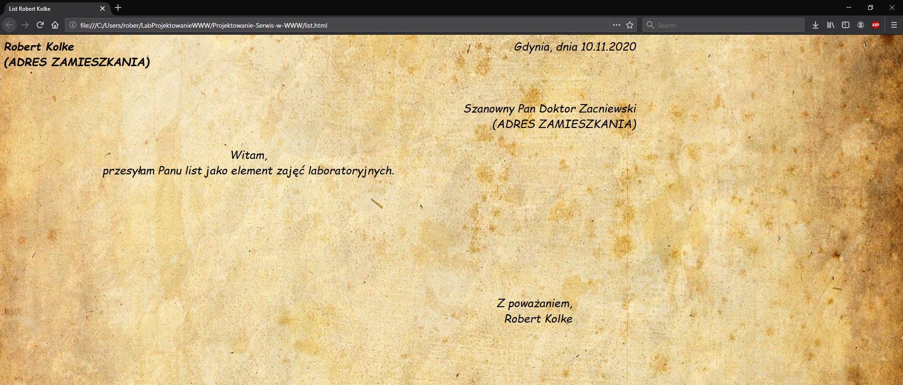
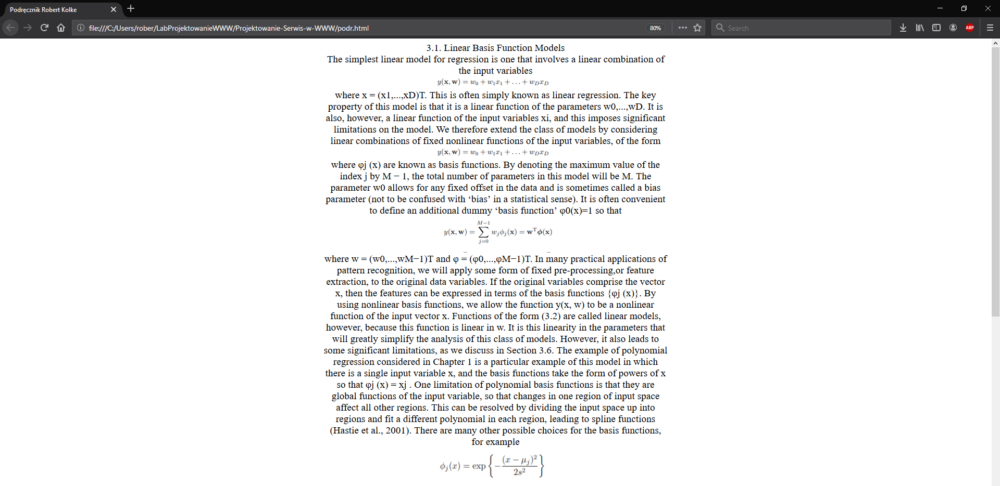
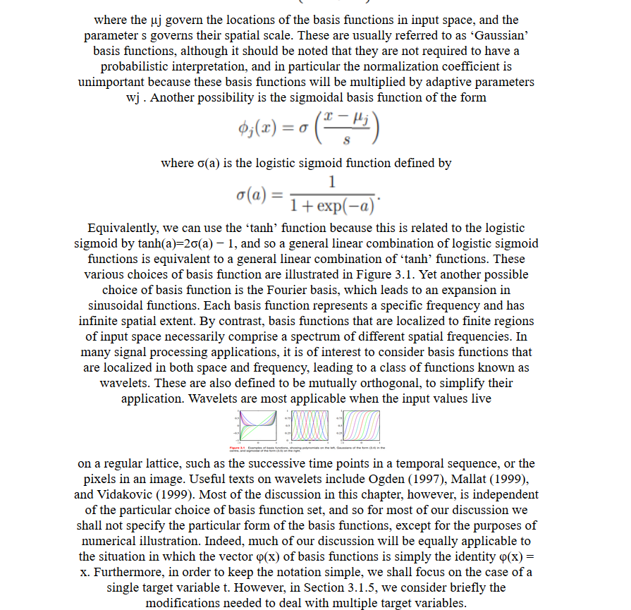
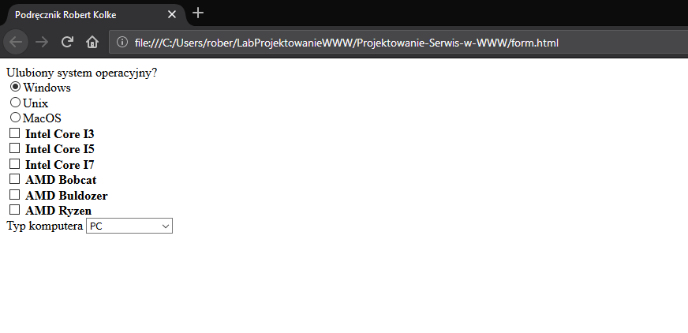

# Projektowanie-Serwisów-WWW

Strona g³ówna oparta na krótkim kodzie z kolorowaniem tekstu i t³a.

List posiada kilka znaczników z sformatowanym kodem. Jako t³a u¿ywa pliku list_papyrus.jpg

Wszystko umieœci³em w 1 bloku tekstu wraz z wzorami w postaci obrazów.

Niewielki formularz opieraj¹cy siê na kilku checkboxach, liœcie rozwijanej i 3 radiobuttonach.

